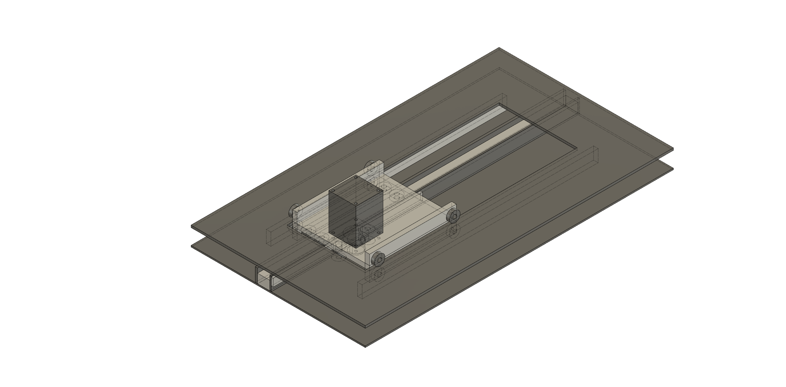
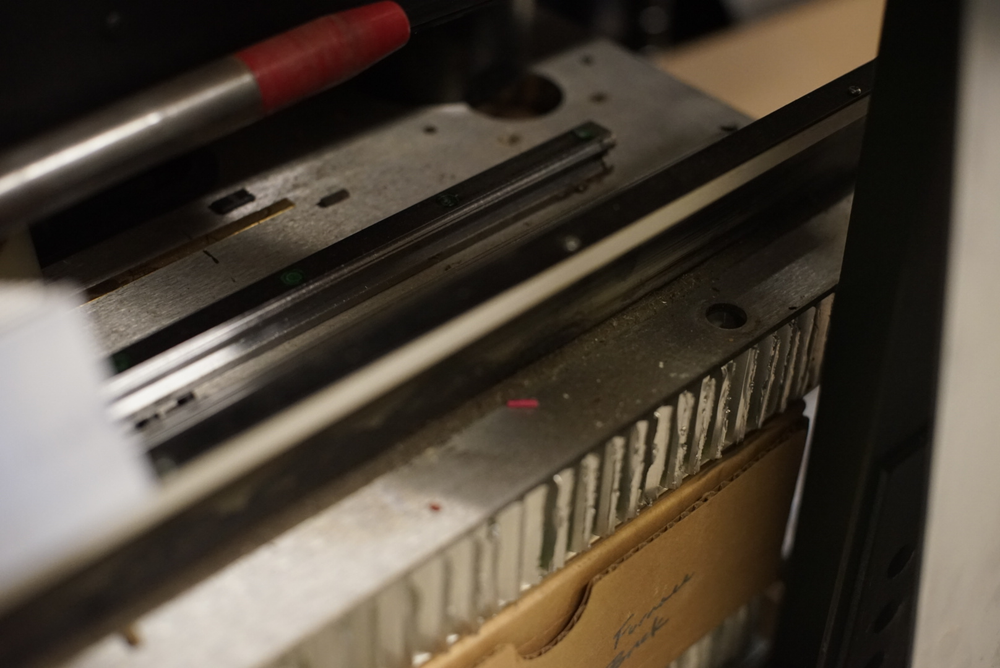
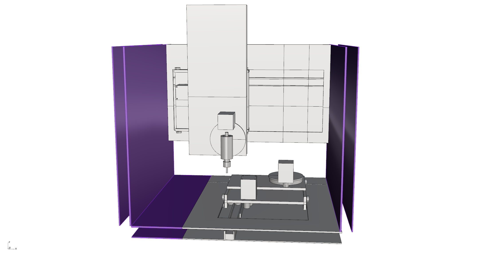
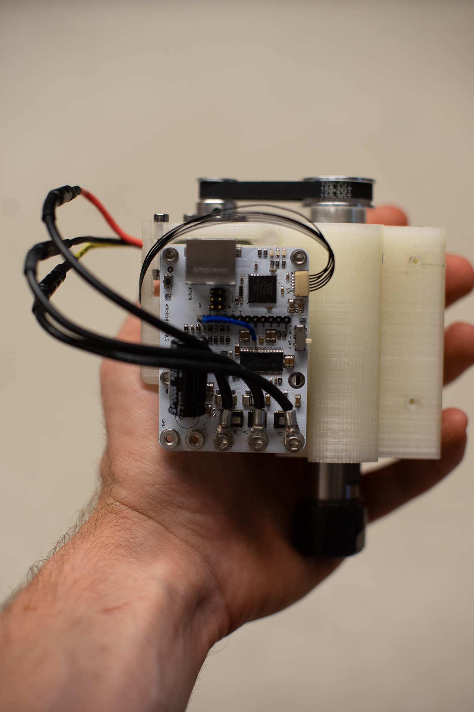

# Five Axis Testbed

A three / five axis milling machine, using sheet steel and honeycomb cores for a high stiffness / weight structure and stiff-belt linear motion for high speed milling: smaller chip loads, big spindle speed, for similar total rate of material removal with smaller instantaneous forces. Rather than a cast iron 'knee-type' structural loop, use a box-type chassis to save weight, cost, size.

Networked motor drivers with force feedback, and towards 14-bit encoder resolution. NEMA23 size. Brushless drive spindle, dreams of an ATC. 

## Linear Axis Design

[Axis Design in Fusion 360](https://a360.co/2NOvLt2)

Individual axis are similar to [RCT gantries](http://gitlab.cba.mit.edu/jakeread/rctgantries) but very stiff! We use laminated sheet steel on honeycomb cores, laid up on an optical bench or similar very-flat surface to image the tool surfaces' flatness. Most components to be waterjet or lasercut, preferring 2D design to 'billet-type' parts for ease of fabrication.

Bearings are 608- type skate bearings, having ~ 300lbs dynamic loading... Running on flat 3/16" stainless sheet. We use eccentric cams to mount bearing in each set, to preload. 

Here's an image of Matthew-Bye (of the MetaBeam laser, and the FabLight) type axis:

Lots to consider here - mostly, motor / belt / idlers relationship, and belt tensioning. Preloading of bearings and access through the honeycomb to that structure.

I've ordered AT5 and T5 belts, to see what meshing is like, as well as a 16T pulley and shaft key for an 8mm NEMA23 motor. 

## Rotary Axis Design

For rotary bearings, I've collected a set of THK RA7008C-UUCOS bearings - cross roller bearings, that do all of the heavy lifting. Rotary axis will have to be mostly billet type parts, that we can design to mount onto linear axis ~ sort of modular-ish, to easily add or remove rotary axis.

## Sketching

To layout, I exported three sets of the fusion model, and laid them out in a plausible configuration. As drawn, there's 300x180x100mm of travel, with a 100x100x100mm 5-axis area. 

The machine can live a run-of-the-mill (haha) 3-axis life or have rotary modules bolted on the y-table and z-axis respectively, to add 5-axis machining. 

## A Spindle

 - I'm looking at [this spindle](https://gitlab.cba.mit.edu/jakeread/simplespindle) done in aluminum to start. Of course, it would be wicked cool to fit with an ATC later on. It's an ER16 collet holder with a ~ 1kW (if I can write enough code for my motor controller) brushless drive.

## Ballparking

 - I started a scratchy spreadsheet to look at motor torques etc ... [that's here](https://docs.google.com/spreadsheets/d/16cy_a2wFJDztn7VV0LmtotWuPZtrBKD17Vx47WoxK5A/edit?usp=sharing) - email me if you want to edit! 

 - I have so far done zero real math! Slocum would not be pleased!

 - Cut Force Estimates w/ speeds, feeds, etc? i.e. what we would be searching for... would like to ballpark to spec motors, drives etc. Belt stiffnesses. machinery handbook?

 - Dynamics? If this is about speed...

 - Motor Control: this is a great time to start working on closed loop stepper-control-as-if-they-were-bldcs... 

 - Toolholding / fixturing... 
